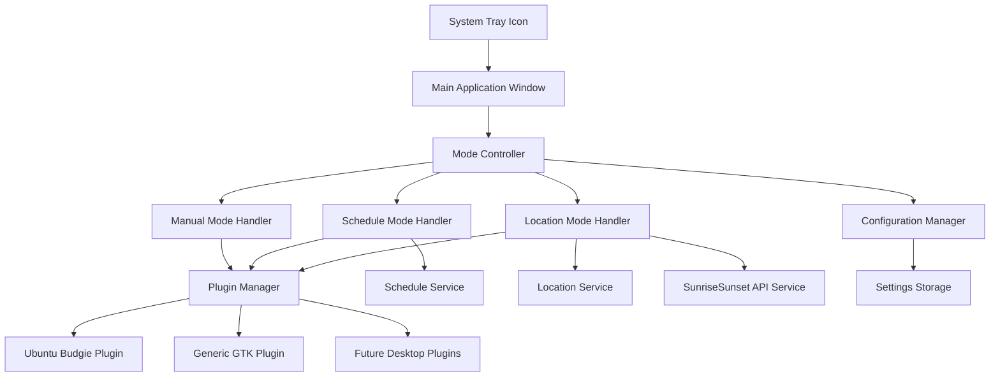

# Design Document

## Overview

Nightswitch is a PyGTK 4-based system tray application that provides comprehensive night mode management for Linux desktop environments. The application follows a modular architecture with a plugin system to support multiple desktop environments, starting with Ubuntu Budgie and expanding to other distributions.

The application consists of three main operational modes:
1. **Manual Mode**: Direct user control via button interface
2. **Schedule Mode**: Time-based automatic switching
3. **Location Mode**: Sunrise/sunset-based automatic switching

## Architecture

### High-Level Architecture



### Core Components

1. **Application Core**
   - Main application entry point
   - GTK application lifecycle management
   - System tray integration

2. **UI Layer**
   - System tray icon with context menu
   - Main window with mode selection interface
   - Status indicators and notifications

3. **Mode Management**
   - Mode controller for coordinating between different switching modes
   - Conflict resolution between modes
   - State management and persistence

4. **Plugin System**
   - Plugin interface definition
   - Plugin discovery and loading
   - Desktop environment detection

5. **Services**
   - Schedule service for time-based switching
   - Location service for IP-based location detection
   - Sunrise/sunset service using sunrisesunset.io API

## Components and Interfaces

### 1. Application Core

**TrayApplication (GTK.Application)**
```python
class TrayApplication(Gtk.Application):
    def __init__(self):
        # Application initialization
        # System tray setup
        # Plugin manager initialization
    
    def do_activate(self):
        # Create and show tray icon
        # Initialize mode controller
    
    def show_main_window(self):
        # Display main interface window
```

**SystemTrayIcon**
```python
class SystemTrayIcon:
    def __init__(self, app):
        # Create status icon using Gtk.StatusIcon or AppIndicator
        # Set up context menu
    
    def on_icon_clicked(self):
        # Show/hide main window
    
    def update_icon(self, mode):
        # Update icon based on current mode
```

### 2. Mode Management

**ModeController**
```python
class ModeController:
    def __init__(self, plugin_manager, config_manager):
        self.current_mode = None
        self.active_handler = None
    
    def set_manual_mode(self, theme):
        # Switch to manual mode and apply theme
    
    def set_schedule_mode(self, dark_time, light_time):
        # Enable schedule-based switching
    
    def set_location_mode(self, location=None):
        # Enable location-based switching
    
    def apply_theme(self, theme):
        # Delegate to plugin manager
```

**Mode Handlers**
```python
class ScheduleModeHandler:
    def __init__(self, controller):
        self.schedule_service = ScheduleService()
    
    def enable(self, dark_time, light_time):
        # Set up scheduled theme switching
    
    def disable(self):
        # Stop scheduled switching

class LocationModeHandler:
    def __init__(self, controller):
        self.location_service = LocationService()
        self.sunrise_sunset_service = SunriseSunsetService()
    
    def enable(self, location=None):
        # Set up location-based switching
```

### 3. Plugin System

**PluginInterface**
```python
from abc import ABC, abstractmethod

class ThemePlugin(ABC):
    @abstractmethod
    def detect_compatibility(self) -> bool:
        # Check if plugin is compatible with current environment
    
    @abstractmethod
    def apply_dark_theme(self) -> bool:
        # Apply dark theme to desktop environment
    
    @abstractmethod
    def apply_light_theme(self) -> bool:
        # Apply light theme to desktop environment
    
    @abstractmethod
    def get_current_theme(self) -> str:
        # Return current theme state
```

**PluginManager**
```python
class PluginManager:
    def __init__(self):
        self.plugins = []
        self.active_plugin = None
    
    def discover_plugins(self):
        # Load available plugins
    
    def select_plugin(self):
        # Choose best plugin for current environment
    
    def apply_theme(self, theme):
        # Delegate to active plugin
```

### 4. UI Components

**MainWindow (Gtk.Window)**
```python
class MainWindow(Gtk.Window):
    def __init__(self, mode_controller):
        # Create main interface layout
        # Set up mode selection groups
    
    def create_manual_group(self):
        # Dark/Light button group
    
    def create_schedule_group(self):
        # Schedule toggle and time inputs
    
    def create_location_group(self):
        # Location toggle and settings
```

### 5. Services

**ScheduleService**
```python
class ScheduleService:
    def __init__(self):
        self.scheduler = None
    
    def set_schedule(self, dark_time, light_time, callback):
        # Set up recurring theme switches
    
    def stop_schedule(self):
        # Cancel scheduled switches
```

**LocationService**
```python
class LocationService:
    def get_current_location(self):
        # Get location via IP geolocation API
    
    def validate_location(self, lat, lon):
        # Validate location coordinates
```

**SunriseSunsetService**
```python
class SunriseSunsetService:
    def __init__(self):
        self.api_base_url = "https://api.sunrisesunset.io"
    
    def get_sun_times(self, lat, lon, date=None):
        # Get sunrise/sunset times from sunrisesunset.io API
        # Returns sunrise and sunset times for given coordinates
    
    def schedule_sun_events(self, lat, lon, callback):
        # Set up sunrise/sunset event scheduling using API data
```

## Data Models

### Configuration Schema

```python
@dataclass
class AppConfig:
    current_mode: str  # 'manual', 'schedule', 'location'
    manual_theme: str  # 'dark', 'light'
    
    # Schedule mode settings
    schedule_enabled: bool
    dark_time: str  # HH:MM format
    light_time: str  # HH:MM format
    
    # Location mode settings
    location_enabled: bool
    latitude: Optional[float]
    longitude: Optional[float]
    auto_location: bool
    
    # Application settings
    start_minimized: bool
    show_notifications: bool
```

### Plugin Configuration

```python
@dataclass
class PluginConfig:
    name: str
    version: str
    compatibility_check: str
    theme_commands: Dict[str, str]
    priority: int
```

## Error Handling

### Error Categories

1. **Plugin Errors**
   - Plugin loading failures
   - Theme application failures
   - Desktop environment compatibility issues

2. **Service Errors**
   - Location detection failures
   - Network connectivity issues for location services
   - Astronomy calculation errors

3. **Configuration Errors**
   - Invalid time formats
   - Corrupted configuration files
   - Permission issues

### Error Handling Strategy

```python
class ErrorHandler:
    def handle_plugin_error(self, error):
        # Log error, try fallback plugin, notify user
    
    def handle_service_error(self, error):
        # Log error, disable affected mode, show user message
    
    def handle_config_error(self, error):
        # Reset to defaults, backup corrupted config, notify user
```

### Fallback Mechanisms

- **Plugin Fallback**: If primary plugin fails, attempt generic GTK theme switching
- **Location Fallback**: If GPS/IP location fails, allow manual location input
- **Configuration Fallback**: If config is corrupted, reset to safe defaults

## Testing Strategy

### Unit Testing

1. **Plugin System Tests**
   - Plugin loading and discovery
   - Theme application methods
   - Compatibility detection

2. **Service Tests**
   - Schedule service timing accuracy
   - Location service API integration
   - Astronomy calculations

3. **Configuration Tests**
   - Settings persistence
   - Configuration validation
   - Migration between versions

### Integration Testing

1. **Mode Switching Tests**
   - Manual mode theme application
   - Schedule mode timing
   - Location mode sunrise/sunset switching

2. **UI Integration Tests**
   - Tray icon functionality
   - Main window interactions
   - Mode conflict resolution

### System Testing

1. **Desktop Environment Tests**
   - Ubuntu Budgie integration
   - Theme switching verification
   - System tray behavior

2. **Cross-Platform Tests**
   - Different GTK versions
   - Various Linux distributions
   - Plugin compatibility

### Test Environment Setup

```python
# Test configuration
TEST_CONFIG = {
    'use_mock_plugins': True,
    'mock_location_service': True,
    'accelerated_time': True,  # For schedule testing
    'test_themes_path': 'tests/fixtures/themes'
}
```

## Implementation Notes

### GTK 4 Considerations

- Use `Gtk.Application` for proper application lifecycle
- Implement system tray using `Gio.Notification` or AppIndicator3
- Handle GTK 4's async patterns for network operations

### Ubuntu Budgie Integration

- Use `gsettings` for color scheme switching: `org.gnome.desktop.interface color-scheme`
- Values: 'default' (light), 'prefer-dark' (dark)
- Monitor for existing theme management tools
- Respect user's existing theme preferences

### Plugin Development Guidelines

- Plugins should be self-contained Python modules
- Each plugin must implement the `ThemePlugin` interface
- Plugins should handle their own error conditions gracefully
- Plugin priority system allows for desktop-specific optimizations

### Performance Considerations

- Lazy loading of plugins and services
- Efficient scheduling using system timers
- Minimal resource usage when running in background
- Caching of location and astronomy data